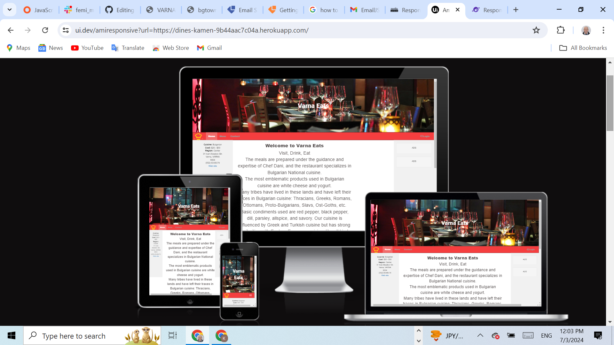
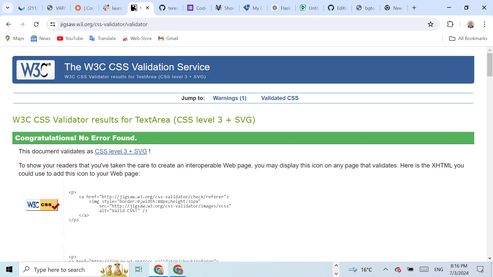
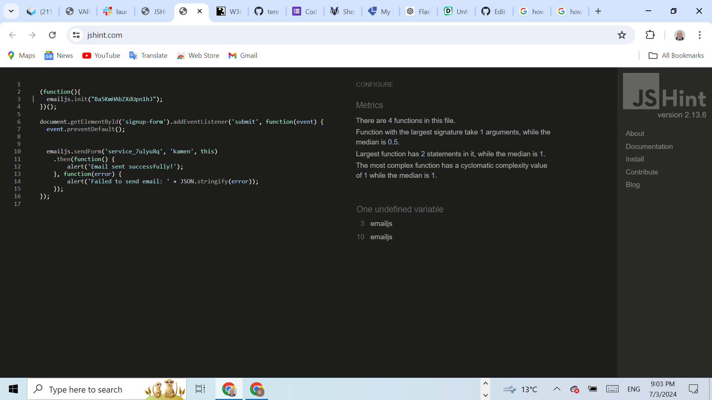
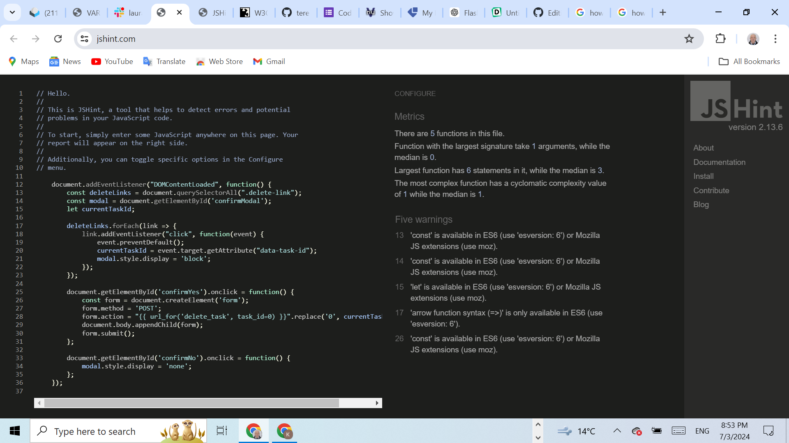
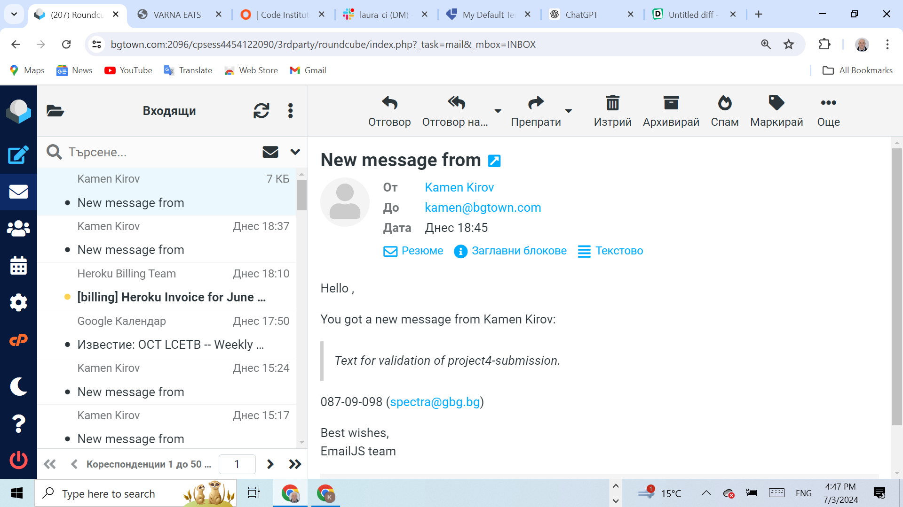
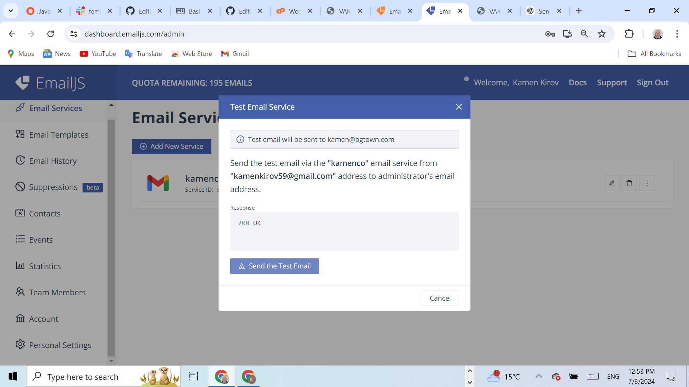
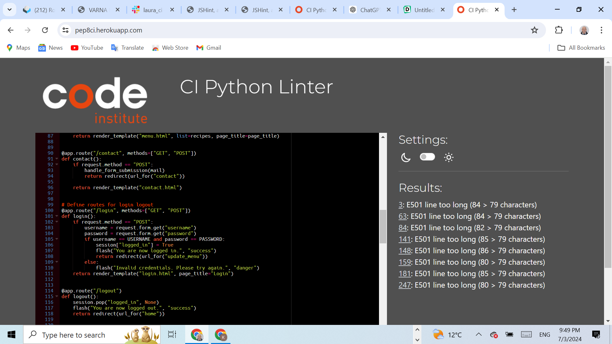
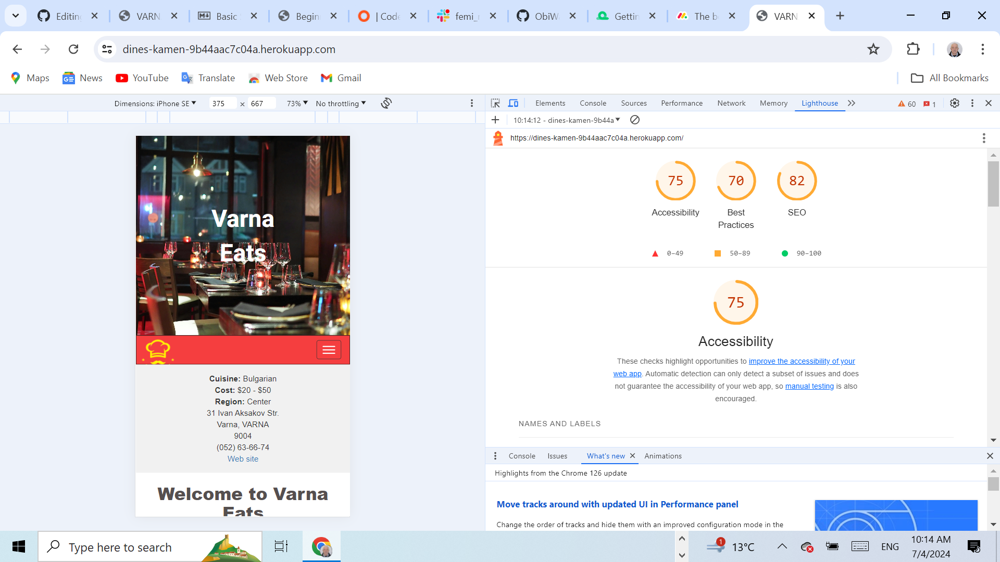
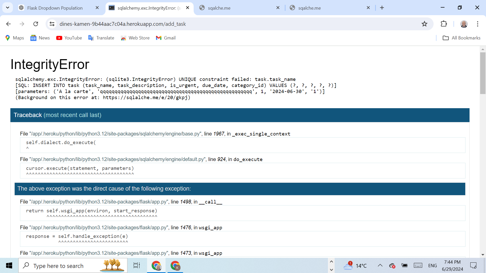

# Varna Eats - Restaurant

## Performance of the web page on different devices



[Click on this link to visit the site on Heroku](https://dines-kamen-9b44aac7c04a.herokuapp.com/)


# Content


## Table of Content 
1. [Wireframe](#wireframe)
2. [UX Description](#ux-description)
3. [Technologies used](#technologies-used)
4. [Website Features](#website-features)
5. [Features to implement](#other-features)
6. [Agile palnning](#agile-planning)
7. [Project structure](#project-structure)
8. [Testing and Validation](#testing-and-validation)
9. [Bugs and Issues](#bugs-and-issues)
10. [404 page](#notfound-page)
11. [Deployment](#deployment)
12. [Credits](#credits)

---

## [Wireframe](#wireframe)

Varna Eats is a web application that allows users to view the menu, make reservations, and manage tasks. This project is built using Flask and is deployed on Heroku.

---

## [UX Description](#ux-description)

This site was designed predominantly for restaurant owners, where they can present their restaurants, the menus, and where they can update the manues using json database, they can also add recepies, update recepies and delete recepies with using jaso as a database. Form the application taskmanager, using databaase SQLLIte the owner or the manager of the restaurant can add tasks, update tasks and delete tasks. The site has also a interactive javascript map facilitating the customers by showing the restaurant's whereabouts. 

The layout is kept pretty simple, with three pages describing the Bulgarian cuisine, the menu page and the contact page from where the customer can make reservations by filling and sending the form. At the far right is the login button from where the owner can log in to update, delete and add recepies of the menu page. From there he can also add tasks, update and delete tasks, helping the owner to better organize his business.

---

## [Technologies used](#technologies-used)

- HTML5, Jinja, . Used to structure my website. There is only one page base.html of this website  and using Jinga mark up the rest of the pages extend the base.html

 Semantic element have been used like container, row, form, div.
 
  Responsive design was implemented by the code in the head with metatag defining the control of page's dimensions and scaling.


- CSS3, Bootstrap: Bootstrap container class provides a responsive fixed-width container.
 The row class is used to create a horizontal group of columns.Justify-content-center: This class centers the content horizontally within the row. col-sm-8: sets the width of the content to 8 columns out of a 12-column grid on small and larger devices, and you can adjust it as needed.
 btn-block uset to buttons for full-width styling. button classes to btn-primary and btn-danger for better visual distinction.

 Responsive web design is used to resize, and shrink, the content to make it look good on any screen.  Box sizing border box was used to  padding and border of element's total width and height. Media query with breakpoint of 420px was used for the responsiveness of the page. Hover css was used on the nav bar onclicking the login, and also onclicking the buttons in the nav panel.

- JavaScript. Used to provide functionality to my website. Event listener used is to handle form submission and send the form data using EmailJS. Included the EmailJS SDK script in the contact.html file. Javascript was used to embed the google map. JavaScript function confirmDelete was used for the defensive design of the delete task. confirmDelete function is used from base.htm  confirmDeleteRecipe and confirmDeleteTask functions are defined and utilized within individual HTML templates.Onsubmit attribute in the delete form calls confirmDelete(event), which asks for confirmation before submitting the delete form. By clearly defining separate routes and ensuring the JavaScript functions are scoped to specific pages, I avoid collisions between the delete actions on different pages. This approach helps to ensure that both the delete functionality for recipes and tasks work independently without interfering with each other.

- Python3 Datetime and dotenv, flask libraries are imported in the main python file. SQLAlchemy is installed,JSON is used for the menu database. Database models are defined for Cathegories and tasks.
The delete_task, add_task, update_task routes are used to correctly handle POST requests to delete, update and add a task and redirect back to the tasks list. Used url_for function to correctly points to the Flask routes. Delete_task, update-task, and add_task routes accept the correct HTTP methods (GET, POST). Ensured Unique URLs for Delete Actions. Making sure the URLs for the delete actions in both update_menu.html and update_task.html are distinct. Handling POST Requests: The update_menu function is updated to load recipes at the beginning. If the request is a POST request and the form contains 'add', it adds the new recipe. If the form contains 'delete', it deletes the selected recipe and writes the updated list back to list.json.

- Github - The cloud based service for hosting repositories for over 73 million developers
- Git - Used to add, commit and push my changes to the server and to create a repository with the help of The Code Institute template.
- Favicon.io - Used to source my favicon icons for my website.
- Google Fonts - Used to source different fonts in my css file. Google font were used Roboto.
- CoralDraw was used to illustrate this page with the flow chart's logic.
- This page was made with Visual Studio Code on gitpod.io, and for deploying the pages the 
git add . git commit and git push commands were used.
- Gitpod.io was used to work on the project.
- Heroku was used to deploy my site.
- 
---

## [Website Features](#website-features)

- View the menu with various recepies.
- Make reservations through a contact form.
- Login and manage the menu (add, update, delete recipes).
- Task management functionality including adding, updating, and deleting tasks.
- Send email for reservations

---

## [Features to implement](#other-features)

Given more time to invest in the project, I would like to implement some more features: 

- The menu page except menues to have prices for each dish with an option for online payment and booking, and also a delivery for home.
  
- The form from the contact page should have dropdown menu for date and time of the reservation, also dropdaown for the main course, starters, desserts, so that those booking for functions, celebrations, receptions and parties can fix their menu beforehnd online.
- To fulfil authomatic testing. For now only manual testing is carried out.  
- This project can target restaurant owners and catering services.
  
 ---
 
## [Agile planning](#agile-planning)

Severel steps were taken into consideration to develop this project. **Requirements** were detailed, **analyses** performed to see what technologies might be used, the **design** was made using bootstrap and CSS combined the **development** was carried out on gitpod.io, **testing** was made only manually, the authomatic testing was abondened due to lack of time. **User stories** were found regarding the usage of the contact submit form, for phones, which are widely used for internet it is difficult, or almost impossible to put the phone numbers with hifens.
Several development cycles were followed **1st cycle iteration** creating the HTML and CSS structure. **2nd cycle iteration** implementing Jinja template language and Flask. **3rd cycle iteration** creating the JSON database for the menues. **4th cycle iteration** Creating SQLLite database with models for categories and tasks. **5th cycle iteration** Creating the contact page with the submit form. Pure python project was abandoned as too complex and unfeasible, in terms of user and password requirements. Implemented the technology ofEmailjs.com for the form submission.

---

 ## [Project structure](#project-structure)

       |-- run.py
      |-- form_handler.py
      |-- env.py
      |-- requirements.txt
      |-- taskmanager/ 
      | |-- init.py
      | |-- templates/
      | | |-- base.html
      | | |-- index.html
      | | |-- menu.html
      | | |-- contact.html
      | | |-- login.html
      | | |-- update_menu.html
      | | |-- tasks.html
      | | |-- add_task.html
      | | |-- update_task.html
      |-- .env
      
    ---  
    
 ## [Testing and Validation](#testing-and-validation)

 The HTML and CSS coding was tested on https://validator.w3.org

 

 Javascript validation. The javascript files have been checked on www.jshint.com. 

 

 Javascript validation

 

---
Form submission validation. Form submission using Javascript.


Validation from emaijs.com



 Python validation

 
 
---

The page is tested on different browsers Chrome, Firefox, Safari, Opera. The page is responsive and contains all the functions accross differenr screens and sizes. The accessibility testing.
For testing accesibility and SEO and Best Practices, I used Lighthouse in Dev tools. 
Lighthouse runs an audit of your website and feeds back a set of scores for accessibility, SEO and best practices among others.



---
## [Bugs and Issues](#bugs-and-issues)

There is an issue with Iphone 13 and iPhone13. The music block is not fully visible. Probably vh for the .btn has to be declared at vh50 which will scale the buttons to 50%. This issue has not been resolved. There is another issue, there is scriool bar on the small portable devices. This is due to the table layout. If there is no table the issue is resolved.


However the programe performs very well on all the rest devices such as iPhone14, pixel7,Samsung Galaxy S8+, Samung Glaxy S20 Ultra.


---

## [404.html](#notfound-page)

404.html page was created and shows that the browser connects to the server but can not find the page.
 - This happens rarely but sometimes the server malfunctions.
 - This happens when the URL is not valid anymore and the file is missing.
 - The page opening is triggerd by the file ".htaccess" located in the root directory. This files serves the purpose of passing on instructions to the server to open the page with code line ErrorDocument 404 /404.html

 - ---

## [Deployment](#deployment)

+ The site was deployed to GitHub pages. The steps to deploy are as follows.
  - In the Git Hub repositorynavigate to the settings tab.
  - From the source section dropdown menu select Master Branch.
  - Once the master branch has been selected, the page provides the link to the live site.

---

## [Credits](#credits)
The music and singing is performed by the developer of this site. The favicons were taken from https://favicon.io/. and namely from the favicon generator. The icons for the project were taken from https://www.klipartz.com/. Before starting the project I was looking for something that will give me the idea of how to implement JavaScript in the best possible way. I ended up not complicating the code as I wanted to stay to the basics of what I have covered so far.
 - The video I used as reference was from Bro code you tube channel. https://youtu.be/n1_vHArDBRA
 - I have added two more characters lizard and spock and changed the Java Script code respetively using the or sign to check for additional charachter. I have also added the reset button and also the 404.html page whith alink to bring back the user to the main page.


The idea for the game was accepted from you tube and I have improved the code by adding two more items Spock and Lizard. The flow control was improved as to the terniary condition was added the OR operator.

The idea for the music block was taken from you tube channel Web Dev Made Easy https://youtu.be/E-v4SSCG6i4
and also from the book "Java Script for Sound Artists" by William Tutner.

This side is used with the help of Codeacademy's course Essential JavaScript and the help of the tutors and facilitators, and mentors. Thanks to facilitator Laura for sending me useful links for React, thanks to Mr. Medale and Marco for the technical support.

[Back to top](#wireframe)

Clone the repository


## Installation

1. **Clone the repository:**
   ```bash
   git clone https://github.com/yourusername/varna-eats.git
   cd varna-eats
Create a virtual environment

python -m venv venv
source venv/bin/activate  # On Windows, use `venv\Scripts\activate`
 Install dependancies

 pip install -r requirements.txt

Set up environment variables, create an env.py file
FLASK_APP=run.py
FLASK_ENV=development
SECRET_KEY=your_secret_key
SQLALCHEMY_DATABASE_URI=sqlite:///taskmanager.db
MAIL_USERNAME=your_email@example.com
MAIL_PASSWORD=your_email_password


Initialize the database

flask db init
flask db migrate -m "Initial migration."
flask db upgrade


# Bug fixes

Check if task with the same name already exists. If it exists the program crashes. 





The bug was solved with adding the code check if a task with the same name already exists
        
        
        existing_task = Task.query.filter_by(task_name=task_name).first()
        if existing_task:
            flash("A task with that name already exists. Please choose a different name.", "danger")
            return redirect(url_for("add_task"))
